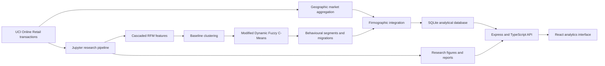

<p align="center">
  
</p>

<h1 align="center">Customer Segmentation in the Retail Sector</h1>

<p align="center">
  A full-stack research platform for firmographic customer segmentation in online retail.
</p>

<p align="center">
  <a href="https://csrs-project.onrender.com/CSRS/"><strong>Live website</strong></a>
  ·
  <a href="https://csrs-project.onrender.com/health">API health check</a>
</p>

## Overview

Customer Segmentation in the Retail Sector (CSRS) is an academic research project that combines **behavioural segmentation** and **geographic segmentation** into one firmographic customer view.

The analytical pipeline uses transaction history from the UK Online Retail dataset to calculate Cascaded RFM features, establish a baseline segmentation, and track customer movement through time with Modified Dynamic Fuzzy C-Means (MDFCM). Geographic market information is then connected to the behavioural results to support location-aware customer analytics and strategic decision-making.

In this project, **firmographic segmentation means the integration of customer behaviour and geographic market context**.
## Research Objectives

- Identify meaningful customer groups from recency, frequency, and monetary behaviour as well as their pairs (recency-frequency, frequency-monetary, recency-monetory).
- Preserve uncertainty through fuzzy membership scores instead of relying only on hard cluster labels.
- Track customer migration, segment stability, centroid movement, and model confidence over time.
- Compare customer value, products, revenue, and behavioural composition across geographic markets.
- Convert notebook and database outputs into an accessible, interactive research interface.

## Analytical Approach

1. **Data preparation** - cleans retail transactions, derives revenue, and creates ordered time cycles.
2. **Cascaded RFM** - calculates Recency, Frequency, and Monetary features together with structural RF, RM, and FM combinations.
3. **Baseline segmentation** - establishes the initial customer clusters and evaluates their quality.
4. **Dynamic MDFCM** - updates fuzzy memberships and centroids across cycles while retaining information from the previous state.
5. **Migration analysis** - measures stable customers, movement between segments, transition flows, and migration rates.
6. **Geographic segmentation** - compares market size, revenue, products, customer value, and behavioural composition by country.
7. **Firmographic integration** - combines behavioural and geographic evidence into one strategic customer view.

The current behavioural segment labels are:

- **Champions**
- **Core Loyalists**
- **Mid-Tier Occasionals**
- **Hibernating / Lost**

## Platform Features

- Executive overview of customer, revenue, product, cycle, and market metrics.
- Searchable customer explorer with value, basket, membership, migration, and transaction history.
- Behavioural segment profiles and strategy recommendations.
- Cycle-by-cycle population, revenue, centroid, confidence, and migration analytics.
- Product performance, portfolio diversity, exclusivity, and segment affinity analysis.
- Geographic market intelligence and country-level behavioural composition.
- Model evaluation using Silhouette, Davies-Bouldin, and Calinski-Harabasz measures.
- Research figure gallery with notebook-generated plots and interactive HTML artifacts.
- Database explorer for viewing the relational analytical tables.
- Light, dark, high-contrast, reduced-motion, font-scaling, and colour-blind-friendly settings.

## System Architecture



## Technology Stack

| Layer | Technologies |
| --- | --- |
| Research and modelling | Python, Jupyter Notebook, pandas, NumPy, scikit-learn, fuzzy clustering, PCA |
| Analytical storage | SQLite |
| Backend | Node.js 22, Express, TypeScript, better-sqlite3, Zod |
| Frontend | React 19, Vite, Recharts, CSS |
| Deployment | Render, GitHub Actions, GitHub Pages |

## Repository Structure

```text
CSRS/
├── interface/
│   ├── backend/                 # Express API and analytical services
│   └── frontend/                # React research interface
├── model/
│   └── pipeline b/
│       ├── csrs_B.ipynb         # Main research and modelling notebook
│       ├── csrs_pipeline_b.db   # SQLite analytical database
│       ├── Online UK_Retail.xlsx
│       └── Research_Figures/    # Baseline, dynamic, geographic, and BI outputs
├── .github/workflows/deploy.yml # GitHub Pages frontend workflow
└── render.yaml                  # Full-stack Render deployment
```

## Running the Project Locally

### Prerequisites

- Node.js `22.x` (the deployed project uses `22.22.0`)
- npm
- Python and Jupyter only if you want to rerun the modelling notebook

### 1. Clone the repository

```bash
git clone https://github.com/SIYABULELA11/CSRS-Project.git
cd CSRS-Project
```

### 2. Start the backend

```bash
cd interface/backend
npm ci
npm run dev
```

The API starts on `http://localhost:4000` and reads the included SQLite database and research artifacts.

### 3. Start the frontend

Open a second terminal:

```bash
cd interface/frontend
npm ci
npm run dev
```

Open `http://localhost:5173/CSRS/`.

### Optional environment configuration

Backend defaults are documented in `interface/backend/.env.example`. The main variables are:

```env
PORT=4000
CORS_ORIGIN=http://localhost:5173
CACHE_TTL_SECONDS=120
DATABASE_PATH=model/pipeline b/csrs_pipeline_b.db
ARTIFACT_ROOT=model
```

The frontend automatically uses `http://localhost:4000` during local development. Set `VITE_API_URL` only when using a different API host.

## API Overview

| Endpoint | Purpose |
| --- | --- |
| `GET /health` | Service health check |
| `GET /api/dashboard/overview` | Headline metrics and dashboard bundle |
| `GET /api/customers` | Filtered and paginated customer records |
| `GET /api/customers/:id` | Detailed customer profile and cycle history |
| `GET /api/segments` | Segment summaries and metrics |
| `GET /api/cycles` | Dynamic cycle analytics |
| `GET /api/migration` | Segment transition and migration analysis |
| `GET /api/analytics/products` | Product and portfolio analytics |
| `GET /api/analytics/geography` | Geographic market analytics |
| `GET /api/model/evaluation` | Model validation metrics |
| `GET /api/artifacts` | Available research figures and reports |
| `GET /api/schema` | Database schema metadata |

## Deployment

The primary live application is deployed as a Render web service:

- Render builds both the backend and frontend from `render.yaml`.
- Express serves the production API and the compiled React application.
- The `/health` endpoint is used for deployment health checks.
- Pushes to the connected `main` branch trigger automatic Render redeployment.

The repository also contains a GitHub Actions workflow that builds the frontend for GitHub Pages. The frontend uses the Render service as its production API.

## Dataset

This project uses the [UCI Online Retail dataset](https://archive.ics.uci.edu/dataset/352/online+retail), which contains 541,909 transactions recorded between 1 December 2010 and 9 December 2011 for a UK-based non-store retailer.

Suggested dataset citation:

> Chen, D. (2015). *Online Retail* [Dataset]. UCI Machine Learning Repository. https://doi.org/10.24432/C5BW33

The dataset is distributed under the [Creative Commons Attribution 4.0 International licence](https://creativecommons.org/licenses/by/4.0/).

## Research Outputs

The repository includes:

- The complete modelling notebook.
- A relational SQLite database containing customer, preprocessing, baseline, dynamic, centroid, segment, product, and cycle results.
- Baseline cluster profiles and PCA visualisations.
- Dynamic migration, transition, population, revenue, confidence, and stability figures.
- Product and business-intelligence figures.
- Geographic segmentation plots.
- Model performance comparisons.

## Limitations

- This is an academic research and decision-support prototype, not a production marketing decision engine.
- Segment names are analytical interpretations of model outputs and should be validated against business context.
- Results depend on the selected cleaning rules, RFM construction, time-cycle design, and model parameters.
- Geographic context is based on transaction country and should not be interpreted as personal demographic profiling.
- A public deployment should avoid adding confidential or personally identifiable customer information.

## Licence and Reuse

The original source code in this repository is available under the [MIT License](LICENSE).

The UCI Online Retail dataset remains governed by its [CC BY 4.0 licence](https://creativecommons.org/licenses/by/4.0/) and attribution requirements. Third-party visual assets remain subject to their respective licences and credits, as documented in `interface/frontend/src/assets/IMAGE_CREDITS.md`.

## Author

Developed by [Siyabulela Malinga](https://github.com/SIYABULELA11) as a customer segmentation research project.
